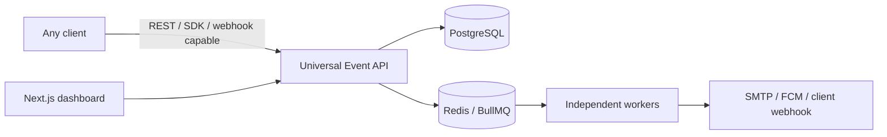

# Universal Notification Platform

Multi-tenant Notification-as-a-Service infrastructure: external systems send a
universal event, the platform authenticates and isolates the tenant, applies
idempotency and workflows, resolves templates and preferences, and delivers
asynchronously through replaceable channels.

## Features

- NestJS REST API with OpenAPI at `/docs`, structured error envelopes, request IDs, health checks, API keys, dashboard JWTs, and RBAC.
- PostgreSQL/Prisma tenant isolation, indexes, compound idempotency, audit logs, encrypted webhook secrets, and transactional outbox.
- BullMQ/Redis email, push, webhook, retry, and dead-letter architecture.
- Real SMTP and FCM integrations when configured; safe console delivery adapters for local use.
- Signed HMAC-SHA256 outbound webhooks with timeout, retry, and attempt tracking.
- Next.js/Tailwind operations dashboard plus JavaScript/TypeScript and Python SDKs.

## Architecture



See [architecture documentation](docs/architecture.md), [API reference](docs/api.md),
[database design](docs/database.md), [workflow lifecycle](docs/workflows.md), and
[deployment guide](docs/deployment.md).

## Requirements

Node.js 22+, Docker Compose, and a PostgreSQL/Redis-capable environment.

## Local installation

```bash
cp .env.example .env
# Replace JWT_SECRET, API_KEY_PEPPER, and WEBHOOK_ENCRYPTION_KEY.
docker compose up -d postgres redis mailpit
npm install
npm run prisma:generate
npx prisma db push --schema prisma/schema.prisma
npm run prisma:seed
npm run dev
```

API: `http://localhost:3000`; Swagger: `http://localhost:3000/docs`; dashboard:
`http://localhost:3001`; local Mailpit: `http://localhost:8025`.

For all containers, run `docker compose up --build`. Docker expects an `.env`
and applies the reviewed initial migration with `prisma migrate deploy`.

## Demo event

The seed command prints a one-time `nk_test_...` key. Use it immediately:

```bash
curl -X POST http://localhost:3000/v1/events \
  -H "Authorization: Bearer nk_test_xxx" \
  -H "Content-Type: application/json" \
  -H "Idempotency-Key: demo-order-123" \
  -d '{"event":"order.created","user":{"id":"demo-user","email":"demo@example.test","name":"Demo User"},"data":{"order_id":"ORD-123","amount":2500}}'
```

The API returns `202` immediately. The worker emits a console email by default;
choose `EMAIL_PROVIDER=smtp` with Mailpit/SMTP configuration for real SMTP.

## SDKs

```ts
import { NotificationClient } from '@notification-platform/sdk';
const client = new NotificationClient({ apiKey: process.env.NOTIFICATION_API_KEY! });
await client.events.create({ event: 'order.created', user: { id: 'user_123' }, data: { order_id: 'ORD-123' } });
```

```python
from notification_platform import NotificationClient
client = NotificationClient(api_key="nk_test_xxx")
client.events.create("order.created", {"id": "user_123"}, {"order_id": "ORD-123"})
```

Any HTTP-capable system can use the REST event API; SDKs are convenience layers,
not a required integration path.

## Providers and security

SMTP requires `SMTP_*`; set `EMAIL_PROVIDER=smtp`. FCM requires the three
`FCM_*` values and `PUSH_PROVIDER=fcm`. Webhook secrets are AES-256-GCM encrypted
at rest and requests are signed as `X-Notification-Signature: sha256=...`.

Never commit `.env`, raw API keys, credentials, or secret-manager exports.
Tenant identity is always resolved from server-side credentials, not the body.

## Testing and quality checks

```bash
npm run build
npm test
npm run test:e2e
git diff --check
```

Tests cover state transitions, templates, API key behavior, and the event flow;
the E2E suite requires the local Postgres and Redis dependencies.

## Roadmap

The intentionally deferred extensions are SMS/WhatsApp/Slack/Discord, iOS APNs,
full conditional/wait/fallback execution and visual workflow editing, provider
failover, analytics warehouse, SSO/SCIM, billing, Kafka, Kubernetes, and
multi-region delivery.
# NotifyKIT
