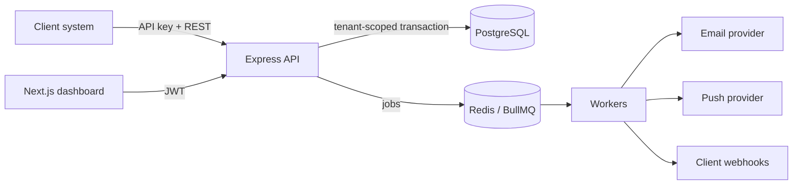
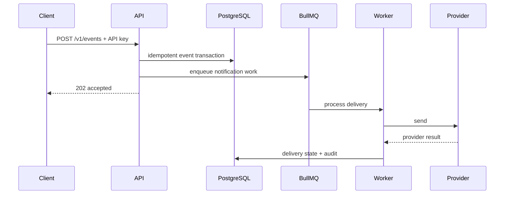
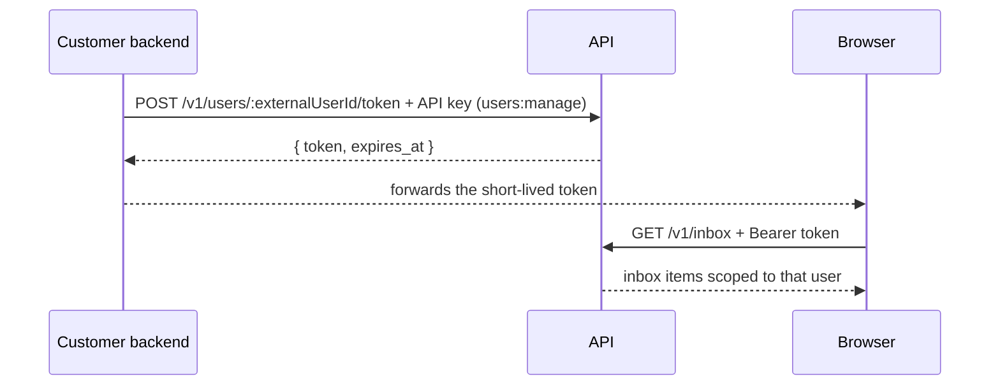
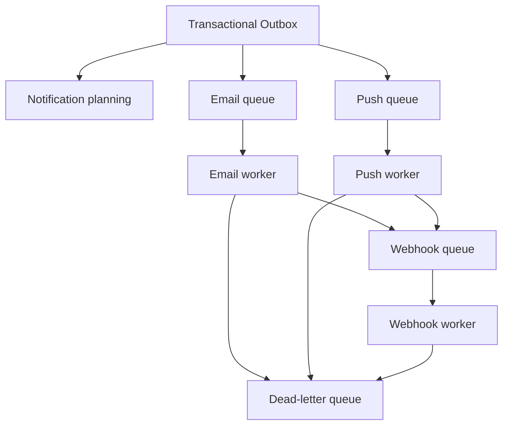

# Architecture

The platform is a modular monolith: the HTTP API remains stateless, PostgreSQL
is the tenant-isolated source of truth, and BullMQ/Redis supplies asynchronous
work execution. Module boundaries allow workers or providers to be extracted
later without changing the public event contract.

## Trust boundaries

API keys resolve a tenant server-side; request bodies never select the tenant.
All tenant-owned queries accept the resolved tenant ID. Raw credentials are
never persisted: API keys use a peppered SHA-256 hash and dashboard passwords
use bcrypt. Webhook secrets are stored for signing only and never returned.

## Event and delivery flow

## Reliability model

The accepted event is committed before its job is enqueued. On enqueue failure,
the API returns a service error rather than pretending the event was accepted.
Workers use deterministic job IDs, classified retryable failures, exponential
backoff, and a dead-letter queue. State transitions are explicitly validated.

## In-app inbox

Browsers cannot hold a tenant's secret API key, so the inbox uses a separate,
short-lived credential instead of extending API-key auth to the client:

The customer's backend authenticates the mint request with its normal secret
API key, then hands the returned JWT to its own frontend. That token is signed
with the same `JWT_SECRET` as dashboard tokens but carries `typ: 'end_user'`
and a short `USER_TOKEN_EXPIRES_IN` expiry (default one hour); `UserTokenService.verify`
rejects any token whose `typ` is not `end_user`, so a dashboard access token
can never be replayed against `/v1/inbox`, and re-checks that the user still
exists and the tenant is ACTIVE on every request rather than trusting a token
minted earlier. `IN_APP` is a delivery channel like email or push: a
notification becomes an inbox item the moment its `IN_APP` delivery is
created, and the worker marks that delivery `SENT` immediately since the
notification row itself is what `/v1/inbox` serves — there is no external
provider round-trip for this channel.

## Scaling

API replicas are stateless. BullMQ workers can be scaled independently by
channel. PostgreSQL indexes tenant/event/status query paths; reporting is kept
as bounded aggregate queries for the MVP and can move to a reporting store.

## Queue topology and failures

BullMQ retries transient provider errors after 30 seconds, 1 minute, 2 minutes,
and 4 minutes. Invalid recipients and permanent 4xx webhook failures are not
retried. Invalid FCM tokens are removed; failures create an explicit delivery
record and terminal jobs are copied to the dead-letter queue.
