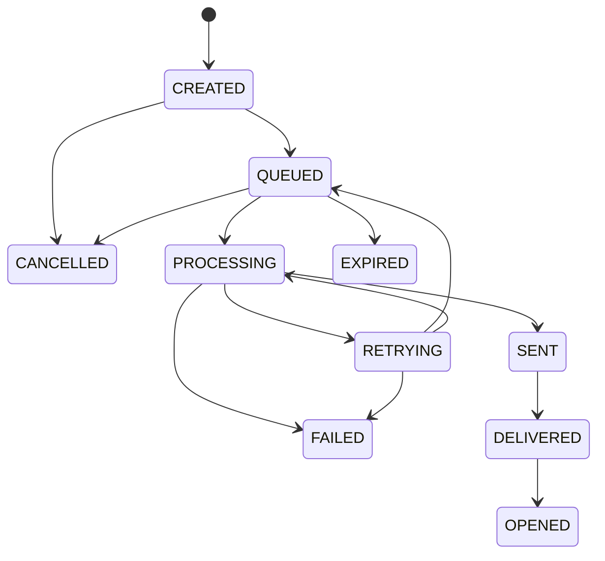

# Workflow and notification lifecycle

Workflows are tenant-scoped JSON documents. The MVP validates the supported
node vocabulary (`EVENT`, `SEND_NOTIFICATION`, `WAIT`, `CONDITION`, `CHANNEL`,
`FALLBACK`, `END`) and executes the first `SEND_NOTIFICATION` routing decision.
`WAIT`, conditional branching, and fallback chains are deliberately retained as
validated definition nodes for the next workflow-runner increment; they are not
silently simulated as executed behavior.

```json
{
  "nodes": [
    { "type": "EVENT" },
    { "type": "SEND_NOTIFICATION", "category": "transactional", "channels": ["EMAIL"], "priority": "HIGH" },
    { "type": "END" }
  ]
}
```

## State machine



The API enforces cancellation transitions and workers enforce terminal states.
Provider acknowledgement is `SENT`; a later provider receipt can transition to
`DELIVERED` without inventing delivery confirmation.
